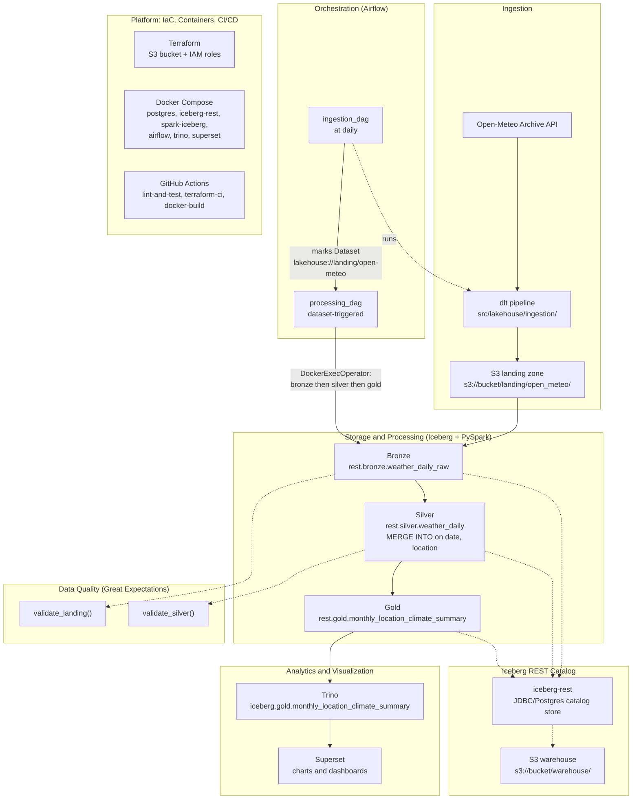

# Architecture

This lakehouse is built as six layers stacked on top of one Iceberg REST catalog: ingestion, storage/processing, quality, orchestration, analytics, and the platform (IaC + containers + CI/CD) underneath all of them. Every box below is a real, deployed component — no aspirational boxes.

## Lineage diagram

## Layer-by-layer

**Ingestion.** A `dlt` pipeline (`src/lakehouse/ingestion/pipeline.py`, `open_meteo.py`) pulls daily historical weather from the Open-Meteo archive API for a fixed set of locations, one `dlt` resource per location with its own incremental date cursor, and lands raw JSON in `s3://<bucket>/landing/open_meteo/`. In production this runs inside Airflow's `ingestion_dag` (`@daily`); `make ingest` runs it standalone against the real bucket.

**Storage & processing.** `src/lakehouse/processing/{bronze,silver,gold}.py` run as PySpark jobs against the Iceberg REST catalog (catalog alias `rest` in Spark, configured in `docker/spark/spark-defaults.conf`). Bronze (`rest.bronze.weather_daily_raw`) reads the raw landing JSON via Spark's Hadoop S3A connector and overwrites in full each run (landing is append-only, so this stays correctly idempotent). Silver (`rest.silver.weather_daily`) dedupes and types the data, `MERGE INTO`-ing on `(date, location)`. Gold (`rest.gold.monthly_location_climate_summary`) recomputes monthly per-location climate aggregates in full. `src/lakehouse/processing/maintenance.py` runs Iceberg compaction and snapshot expiration across all three tables.

**Catalog.** All three tables — and every engine that reads them (Spark, Trino) — go through the same Iceberg REST catalog (`iceberg-rest`, backed by a Postgres-hosted JDBC catalog store, table data in the S3 warehouse at `s3://<bucket>/warehouse/`). There is exactly one source of truth for table metadata; nothing is synced or copied between engines.

**Data quality.** `src/lakehouse/quality/expectations.py` validates in-line with the real pipeline, not as a side job: `validate_landing()` runs structural/range checks on the raw Bronze read (known locations, plausible temperature/precipitation ranges), `validate_silver()` adds `(date, location)` uniqueness and a `temperature_max >= temperature_min` cross-column check on the deduplicated Silver data. Either raises on failure, matching this pipeline's fail-loud pattern everywhere else.

**Orchestration.** Two Airflow DAGs (`dags/ingestion_dag.py`, `dags/processing_dag.py`) linked by an Airflow Dataset rather than a fixed time offset: `ingestion_dag` (`@daily`) runs the dlt pipeline in-process and marks the `lakehouse://landing/open-meteo` Dataset updated on success; `processing_dag` (Dataset-triggered) then runs `bronze >> silver >> gold` as three sequential tasks via a custom `DockerExecOperator` (`src/lakehouse/orchestration/docker_exec.py` + `dags/operators/docker_exec_operator.py`) that execs the same `spark-submit` commands `make spark-bronze` etc. run manually, inside the already-running `spark-iceberg` container.

**Analytics & visualization.** Trino queries the Gold table directly through the REST catalog (`docker/trino/catalog/iceberg.properties`) — no export or sync step. Apache Superset connects to Trino as its SQL source and renders charts/dashboards from `iceberg.gold.monthly_location_climate_summary`; Superset's own metadata store is a second database on the same shared Postgres container Airflow already uses.

**Platform.** Terraform (`terraform/modules/{s3_bucket,iam_pipeline_role,github_actions_role}`) provisions the S3 bucket, the assumable pipeline IAM role, and a narrowly-scoped read-only CI role trusted via GitHub OIDC federation (no static AWS keys anywhere). Docker Compose (`docker-compose.yml`) runs the entire local stack — Postgres, the Iceberg REST catalog, Spark, Airflow, Trino, and Superset — as a single `make up`. GitHub Actions (`.github/workflows/`) lints and tests every push/PR, validates Terraform on every push/PR and runs a real `terraform plan` (OIDC-authenticated, push/dispatch only — never reachable from a fork PR) on `master`, and builds + Trivy-scans both Docker images.

## End to end, for one day's data

A `processing_dag` run for a given day starts with `ingestion_dag` calling the Open-Meteo API for each configured location and appending the new raw JSON to the S3 landing zone. Once all locations have landed, the Dataset flips and `processing_dag` fires: Bronze re-reads the full landing zone into `rest.bronze.weather_daily_raw` (validated by `validate_landing()`), Silver deduplicates and merges it into `rest.silver.weather_daily` keyed on `(date, location)` (validated by `validate_silver()`), and Gold recomputes the monthly aggregate in `rest.gold.monthly_location_climate_summary`. From that point on, the new numbers are already live — Trino reads the same Iceberg REST catalog Spark just wrote to, and Superset's dashboards reflect the updated Gold table on their next query, with no batch export or cache-refresh step anywhere in between.
