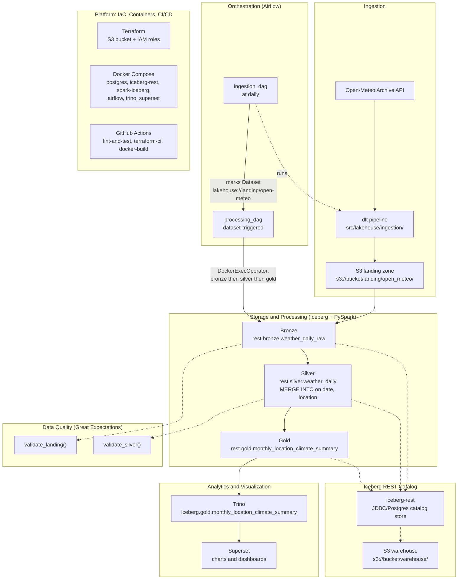

# Architecture

This lakehouse is built in six layers, all sitting on top of one Iceberg REST catalog: ingestion, storage and processing, quality, orchestration, analytics, and the platform underneath everything (IaC, containers, and CI/CD). Everything in the diagram below is something that's actually running, not an aspirational architecture.

## Lineage diagram

## Layer-by-layer

**Ingestion.** A `dlt` pipeline (`src/lakehouse/ingestion/pipeline.py`, `open_meteo.py`) pulls daily historical weather from the Open-Meteo archive API for a fixed set of locations. Each location gets its own `dlt` resource with its own incremental date cursor, and the raw JSON lands in `s3://<bucket>/landing/open_meteo/`. In production this runs inside Airflow's `ingestion_dag` (`@daily`), and `make ingest` runs it standalone against the real bucket.

**Storage and processing.** `src/lakehouse/processing/{bronze,silver,gold}.py` run as PySpark jobs against the Iceberg REST catalog (catalog alias `rest` in Spark, configured in `docker/spark/spark-defaults.conf`). Bronze (`rest.bronze.weather_daily_raw`) reads the raw landing JSON through Spark's Hadoop S3A connector and overwrites the table in full on every run, which stays correctly idempotent since landing is append-only. Silver (`rest.silver.weather_daily`) dedupes and types the data, merging into the table on `(date, location)`. Gold (`rest.gold.monthly_location_climate_summary`) recomputes the monthly per-location climate aggregates from scratch each time. `src/lakehouse/processing/maintenance.py` handles Iceberg compaction and snapshot expiration across all three tables.

**Catalog.** All three tables, and every engine that reads them (Spark, Trino), go through the same Iceberg REST catalog. It's backed by a Postgres-hosted JDBC catalog store, with the actual table data sitting in the S3 warehouse at `s3://<bucket>/warehouse/`. There's exactly one source of truth for table metadata, and nothing gets synced or copied between engines.

**Data quality.** `src/lakehouse/quality/expectations.py` validates in-line with the real pipeline rather than as a separate side job. `validate_landing()` runs structural and range checks on the raw Bronze read, things like known locations and plausible temperature and precipitation ranges. `validate_silver()` runs on the deduplicated Silver data and adds a `(date, location)` uniqueness check plus a `temperature_max >= temperature_min` cross-column check. Both raise on failure, matching this pipeline's fail-loud pattern everywhere else.

**Orchestration.** Two Airflow DAGs, `dags/ingestion_dag.py` and `dags/processing_dag.py`, are linked by an Airflow Dataset rather than a fixed time offset. `ingestion_dag` (`@daily`) runs the dlt pipeline in-process and marks the `lakehouse://landing/open-meteo` Dataset updated once it succeeds. That triggers `processing_dag`, which runs `bronze`, `silver`, and `gold` as three sequential tasks through a custom `DockerExecOperator` (`src/lakehouse/orchestration/docker_exec.py` + `dags/operators/docker_exec_operator.py`). It execs the same `spark-submit` commands that `make spark-bronze` and friends already run manually, inside the already-running `spark-iceberg` container.

**Analytics and visualization.** Trino queries the Gold table directly through the REST catalog (`docker/trino/catalog/iceberg.properties`), with no export or sync step in between. Apache Superset connects to Trino as its SQL source and renders charts and dashboards from `iceberg.gold.monthly_location_climate_summary`. Superset's own metadata store is just a second database on the same shared Postgres container Airflow already uses.

**Platform.** Terraform (`terraform/modules/{s3_bucket,iam_pipeline_role,github_actions_role}`) provisions the S3 bucket, the assumable pipeline IAM role, and a narrowly-scoped read-only CI role trusted through GitHub OIDC federation, so there are no static AWS keys anywhere. Docker Compose (`docker-compose.yml`) runs the entire local stack as a single `make up`: Postgres, the Iceberg REST catalog, Spark, Airflow, Trino, and Superset. GitHub Actions (`.github/workflows/`) lints and tests every push and PR, validates Terraform on every push and PR, runs a real `terraform plan` on `master` (OIDC-authenticated, triggered only by a push or dispatch, never reachable from a fork PR), and builds and Trivy-scans both Docker images.

## End to end, for one day's data

A `processing_dag` run for a given day starts with `ingestion_dag` calling the Open-Meteo API for each configured location and appending the new raw JSON to the S3 landing zone. Once every location has landed, the Dataset flips and `processing_dag` fires. Bronze re-reads the full landing zone into `rest.bronze.weather_daily_raw`, checked by `validate_landing()`. Silver deduplicates it and merges it into `rest.silver.weather_daily` keyed on `(date, location)`, checked by `validate_silver()`. Gold recomputes the monthly aggregate in `rest.gold.monthly_location_climate_summary`. From that point on, the new numbers are already live: Trino reads the same Iceberg REST catalog Spark just wrote to, and Superset's dashboards pick up the updated Gold table on their next query, with no batch export or cache refresh anywhere in between.
